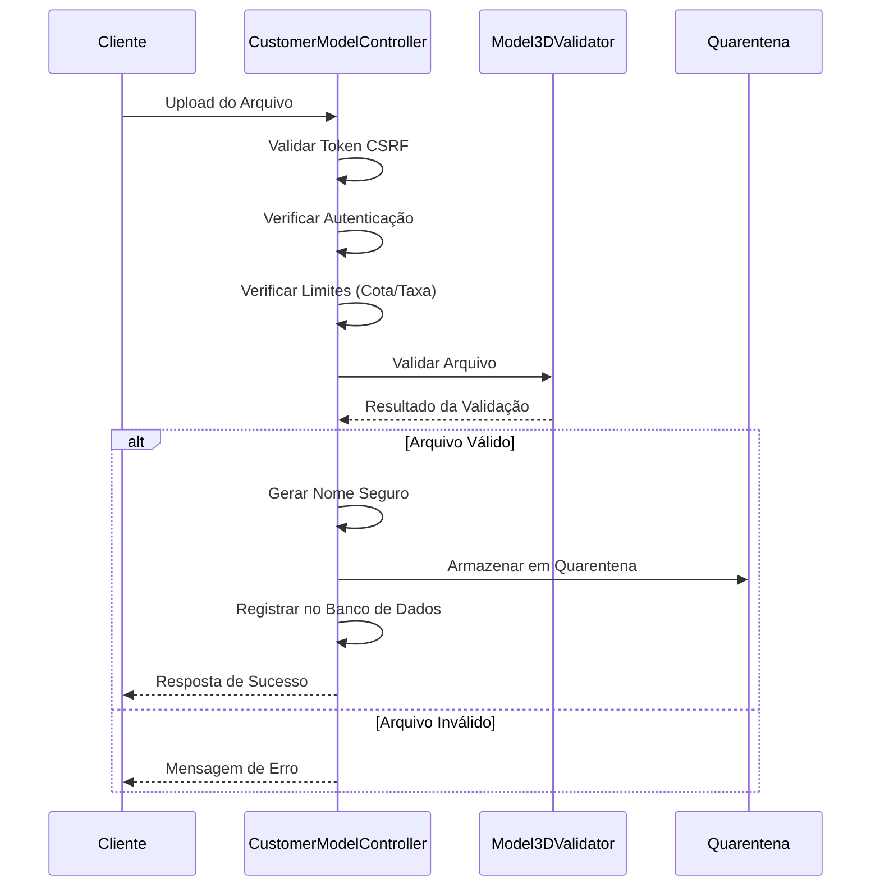
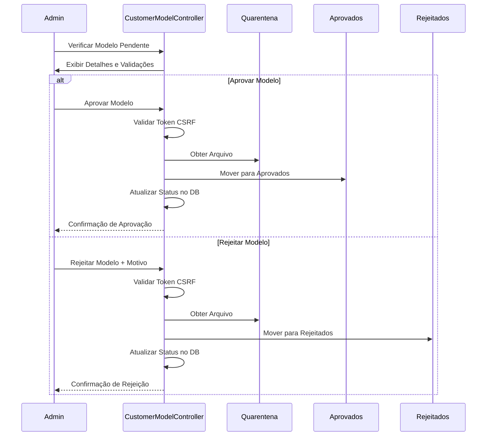

# Segurança do Sistema de Upload de Modelos 3D

## Visão Geral

A implementação de segurança do sistema de upload de modelos 3D para a Taverna da Impressão 3D emprega múltiplas camadas de proteção para prevenir vulnerabilidades comuns em sistemas de upload de arquivos, enquanto proporciona uma experiência de usuário satisfatória.

Este documento descreve as medidas de segurança implementadas, as validações aplicadas e os fluxos de processamento de arquivos.

## Arquitetura de Segurança

O sistema utiliza uma arquitetura de múltiplas camadas para garantir a segurança dos uploads:

1. **Validação no Cliente**
   - Verificação de extensão de arquivo
   - Validação prévia de tamanho antes do upload
   - Verificação de conformidade com limites

2. **Verificação no Servidor (Primeira Camada)**
   - Validação de tokens CSRF para prevenir ataques CSRF
   - Verificação de autenticação e autorização
   - Validação de limites de upload (cota e taxa)

3. **Validação Especializada (Segunda Camada)**
   - Validação profunda de formato específico por tipo (STL, OBJ, 3MF)
   - Verificação de integridade estrutural dos arquivos
   - Validação de metadados e propriedades

4. **Quarentena e Processamento Seguro**
   - Armazenamento em diretório de quarentena isolado
   - Verificações adicionais de segurança
   - Geração de nomes de arquivos seguros

5. **Aprovação Administrativa**
   - Revisão manual obrigatória
   - Verificações técnicas adicionais
   - Movimentação para diretórios apropriados conforme status

## Componentes do Sistema

### Model3DValidator

A classe `Model3DValidator` é responsável pela validação especializada de arquivos de modelos 3D:

```php
class Model3DValidator {
    /**
     * Valida um arquivo de modelo 3D
     * 
     * @param array $file Informações do arquivo ($_FILES['campo'])
     * @param array $options Opções adicionais de validação
     * @return array Resultado da validação ['valid' => bool, 'message' => string, 'data' => array]
     */
    public static function validate($file, array $options = []) {
        // Implementação completa com validações específicas por tipo de arquivo
    }
    
    /**
     * Valida um arquivo STL
     */
    private static function validateStlFile($filePath, $extractInfo = false) {
        // Verifica formato STL (binário/ASCII)
        // Valida integridade estrutural
        // Extrai metadados (triângulos, dimensões)
    }
    
    /**
     * Valida um arquivo OBJ
     */
    private static function validateObjFile($filePath, $extractInfo = false) {
        // Verifica estrutura de vértices e faces
        // Valida referências internas
        // Extrai metadados
    }
    
    /**
     * Valida um arquivo 3MF
     */
    private static function validate3mfFile($filePath, $extractInfo = false) {
        // Verifica estrutura do ZIP
        // Valida arquivos XML internos
        // Verifica conformidade com especificação
    }
    
    /**
     * Executa verificações de segurança adicionais no arquivo
     */
    private static function performSecurityChecks($filePath, $extension) {
        // Verifica assinaturas maliciosas
        // Detecta anomalias estruturais
        // Verifica integridade
    }
}
```

### Estrutura de Diretórios Seguros

O sistema organiza os arquivos em diretórios separados baseados em seu status de processamento:

```
/uploads/models/
  /quarantine/   # Armazenamento temporário para modelos pendentes de análise
  /approved/     # Modelos aprovados e verificados
  /rejected/     # Modelos rejeitados (mantidos para auditoria)
```

Essa estrutura garante isolamento entre arquivos em diferentes estágios do fluxo de aprovação.

## Fluxo de Processamento

### 1. Upload e Validação Inicial



### 2. Fluxo de Aprovação Administrativa



## Medidas de Segurança Específicas

### 1. Prevenção contra Upload de Código Malicioso

```php
private static function performSecurityChecks($filePath, $extension) {
    // Verificar assinaturas de código malicioso
    $handle = fopen($filePath, 'rb');
    if ($handle) {
        $content = fread($handle, min(filesize($filePath), 1024 * 1024)); // Ler até 1MB
        fclose($handle);
        
        // Padrões de segurança para verificar
        $maliciousPatterns = [
            '/<script\b[^>]*>(.*?)<\/script>/is',
            '/eval\s*\(/is',
            '/exec\s*\(/is',
            '/system\s*\(/is',
            '/%PDF/is',     // Arquivos PDF podem conter código JavaScript malicioso
            '/JFIF/',       // Arquivos JPEG manipulados
            '/GIF8/',       // Arquivos GIF manipulados
            '/PNG/',        // Arquivos PNG manipulados
            '/PK\x03\x04/'  // Arquivos ZIP/JAR que não sejam 3MF válidos
        ];
        
        foreach ($maliciousPatterns as $pattern) {
            if (preg_match($pattern, $content)) {
                return [
                    'passed' => false,
                    'message' => 'Detectado conteúdo potencialmente malicioso'
                ];
            }
        }
    }
    
    // Restante das verificações...
}
```

### 2. Geração de Nomes de Arquivo Seguros

```php
private function generateSecureFilename($userId, $extension) {
    // Gerar string aleatória
    $randomStr = bin2hex(random_bytes(16)); // 32 caracteres de entropia
    
    // Formar nome seguro: user_id + timestamp + random + extension
    // Exemplos:
    // - user_123_1649873264_a1b2c3d4e5f6g7h8i9j0k1l2m3n4o5p6.stl
    // - user_456_1649873304_q7r8s9t0u1v2w3x4y5z6a7b8c9d0e1f2.obj
    $safeFilename = 'user_' . $userId . '_' . time() . '_' . $randomStr . '.' . $extension;
    
    return $safeFilename;
}
```

### 3. Validação Rigorosa de Tokens CSRF

```php
// Validar token CSRF
$csrfToken = $this->postValidatedParam('csrf_token', 'string', [
    'required' => true
]);

if (!CsrfProtection::validateToken($csrfToken)) {
    $this->setFlashMessage('error', 'Token de segurança inválido. Por favor, tente novamente.');
    $this->redirect('/customer-models/upload');
    return;
}
```

### 4. Validação Estrutural Específica por Formato

#### Exemplo: Validação STL

```php
private static function validateStlFile($filePath, $extractInfo = false) {
    try {
        $handle = fopen($filePath, 'rb');
        if (!$handle) {
            return $extractInfo ? ['valid' => false, 'message' => 'Não foi possível abrir o arquivo para análise'] : false;
        }
        
        // Ler os primeiros bytes para determinar se é ASCII ou binário
        $header = fread($handle, 5);
        rewind($handle);
        
        $isBinary = !preg_match('/^solid/i', $header);
        
        if ($isBinary) {
            // Validação de STL binário
            $header = fread($handle, 80); // Cabeçalho de 80 bytes
            $triangleCountBin = fread($handle, 4);
            
            if (strlen($triangleCountBin) !== 4) {
                fclose($handle);
                return $extractInfo ? ['valid' => false, 'message' => 'Formato STL binário inválido'] : false;
            }
            
            // Extrair contagem de triângulos
            $triangleCount = unpack('V', $triangleCountBin)[1];
            
            // Verificar coerência do arquivo
            $expectedSize = 84 + ($triangleCount * 50);
            $actualSize = filesize($filePath);
            
            // Tolerância para metadados adicionais
            $tolerance = $expectedSize * 0.01;
            if (abs($actualSize - $expectedSize) > $tolerance) {
                fclose($handle);
                return $extractInfo ? ['valid' => false, 'message' => 'Estrutura de arquivo STL binário inválida'] : false;
            }
            
            // Extração de metadados...
        } else {
            // Validação de STL ASCII
            $content = fread($handle, filesize($filePath));
            
            // Verificar presença de "endsolid"
            if (!preg_match('/endsolid/i', $content)) {
                fclose($handle);
                return $extractInfo ? ['valid' => false, 'message' => 'Formato STL ASCII inválido'] : false;
            }
            
            // Extração de metadados...
        }
        
        fclose($handle);
        return true;
        
    } catch (Exception $e) {
        if (isset($handle) && is_resource($handle)) {
            fclose($handle);
        }
        return $extractInfo ? ['valid' => false, 'message' => 'Erro ao validar arquivo STL: ' . $e->getMessage()] : false;
    }
}
```

## Medidas Adicionais de Proteção

### 1. Controle de Cota de Armazenamento

```php
private function checkUserQuota($userId) {
    // Calcular uso atual
    $usedSpace = $this->customerModelModel->calculateUserStorageUsage($userId);
    
    // Definir cota máxima (200MB para usuários comuns)
    $isAdmin = $this->isAdmin();
    $maxQuota = $isAdmin ? 1073741824 : 209715200; // 1GB para admin, 200MB para usuários
    
    // Calcular espaço restante
    $remainingSpace = $maxQuota - $usedSpace;
    
    return [
        'allowed' => $remainingSpace > 0,
        'message' => $remainingSpace <= 0 ? 'Você atingiu sua cota de armazenamento.' : '',
        'maxQuota' => $maxQuota,
        'usedSpace' => $usedSpace,
        'remainingSpace' => $remainingSpace,
        'percentUsed' => ($usedSpace / $maxQuota) * 100,
        // Formatar para exibição...
    ];
}
```

### 2. Limitação de Taxa de Upload

```php
private function checkUserRateLimit($userId) {
    // Contar uploads na última hora
    $recentUploads = $this->customerModelModel->countRecentUploads($userId, 60); // 60 minutos
    
    // Definir limites
    $isAdmin = $this->isAdmin();
    $maxUploadsPerHour = $isAdmin ? 50 : 5;
    
    return [
        'allowed' => $recentUploads < $maxUploadsPerHour,
        'message' => $recentUploads >= $maxUploadsPerHour ? 
            'Você excedeu o limite de uploads. Tente novamente mais tarde.' : '',
        'maxUploadsPerHour' => $maxUploadsPerHour,
        'recentUploads' => $recentUploads,
        'remainingUploads' => $maxUploadsPerHour - $recentUploads
    ];
}
```

### 3. Permissões Restritas de Arquivos

```php
// Após mover o arquivo para o diretório
chmod($filePath, 0644); // Somente leitura para grupo e outros
```

### 4. Registro de Auditoria

```php
// Registrar evento de upload no log de auditoria
$this->customerModelModel->logModelEvent(
    $modelId,
    $userId,
    'upload',
    [
        'filename' => $safeFilename,
        'original_name' => $originalName,
        'file_size' => $_FILES['model_file']['size'],
        'file_type' => $extension,
        'ip_address' => $_SERVER['REMOTE_ADDR'],
        'user_agent' => $_SERVER['HTTP_USER_AGENT']
    ]
);
```

## Matriz de Vulnerabilidades Mitigadas

| Vulnerabilidade | Técnica de Mitigação | Implementação |
|-----------------|----------------------|---------------|
| Upload de arquivos maliciosos | Validação de tipo e conteúdo | `Model3DValidator::validate()` |
| Ataques CSRF | Tokens CSRF em formulários | `CsrfProtection::validateToken()` |
| Path Traversal | Geração segura de nomes de arquivo | `generateSecureFilename()` |
| Negação de Serviço (DoS) | Limites de cota e taxa | `checkUserQuota()`, `checkUserRateLimit()` |
| Cross-Site Scripting (XSS) | Sanitização de dados | `InputValidationTrait::postValidatedParam()` |
| Execução Remota de Código | Validação estrutural profunda | `validateStlFile()`, `validateObjFile()`, `validate3mfFile()` |
| Bypass de validação | Validação em múltiplas camadas | Cliente + Servidor + Estrutural |
| Ataques de força bruta | Limite de taxa por usuário | `checkUserRateLimit()` |

## Testes de Segurança

### Testes Manuais

1. **Verificação de Bypass de Extensão**
   - Renomear arquivos maliciosos para extensões permitidas
   - Verificar validação de conteúdo real

2. **Verificação de Limite de Tamanho**
   - Tentar enviar arquivos com tamanho excessivo
   - Verificar validação de limites

3. **Verificação de Estrutura**
   - Tentar enviar arquivos corrompidos com extensões válidas
   - Verificar validação estrutural

### Testes Automatizados

Implementação de testes automatizados para verificação contínua da segurança:

```php
// Exemplo de teste automatizado para validação de modelos 3D
public function testModel3DValidator() {
    // Testar arquivo STL válido
    $validStlResult = Model3DValidator::validate([
        'tmp_name' => FIXTURES_PATH . '/valid_model.stl',
        'name' => 'valid_model.stl',
        'size' => filesize(FIXTURES_PATH . '/valid_model.stl'),
        'error' => UPLOAD_ERR_OK
    ]);
    $this->assertTrue($validStlResult['valid']);
    
    // Testar arquivo STL inválido
    $invalidStlResult = Model3DValidator::validate([
        'tmp_name' => FIXTURES_PATH . '/invalid_model.stl',
        'name' => 'invalid_model.stl',
        'size' => filesize(FIXTURES_PATH . '/invalid_model.stl'),
        'error' => UPLOAD_ERR_OK
    ]);
    $this->assertFalse($invalidStlResult['valid']);
    
    // Testar arquivo potencialmente malicioso
    $maliciousResult = Model3DValidator::validate([
        'tmp_name' => FIXTURES_PATH . '/malicious.stl',
        'name' => 'malicious.stl',
        'size' => filesize(FIXTURES_PATH . '/malicious.stl'),
        'error' => UPLOAD_ERR_OK
    ]);
    $this->assertFalse($maliciousResult['valid']);
    $this->assertStringContainsString('malicioso', $maliciousResult['message']);
}
```

## Recomendações Futuras

1. **Implementar Análise Automatizada Avançada**
   - Integrar bibliotecas especializadas para análise de modelos 3D
   - Detectar problemas estruturais que afetariam a impressão

2. **Análise de Malware Especializada**
   - Implementar verificação de assinaturas conhecidas de malware
   - Integrar com sistemas de detecção de malware

3. **Implementar Sandbox para Processamento**
   - Processar arquivos em ambiente isolado
   - Proteger contra novas formas de exploração

4. **Verificações Adicionais para Impressibilidade**
   - Verificar se o modelo é "imprimível" (sem faces não-manifestas, etc.)
   - Detectar problemas que afetariam a qualidade da impressão

5. **Backups Cifrados**
   - Armazenar backups cifrados dos modelos aprovados
   - Permitir recuperação em caso de corrupção ou ataque

## Conclusão

O sistema de upload de modelos 3D implementa múltiplas camadas de segurança para proteger contra vetores de ataque comuns em sistemas de upload de arquivos. A combinação de validação no cliente, verificações no servidor, validação estrutural específica por formato, armazenamento em quarentena e aprovação administrativa fornece uma abordagem abrangente para garantir a segurança do sistema.

A implementação considera não apenas a segurança contra ataques maliciosos, mas também a garantia de qualidade dos modelos 3D para impressão, melhorando a experiência geral dos usuários e a eficiência operacional da Taverna da Impressão 3D.
